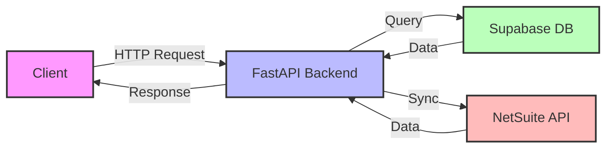
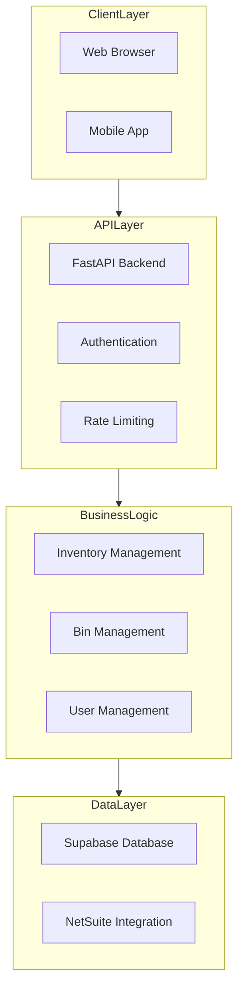
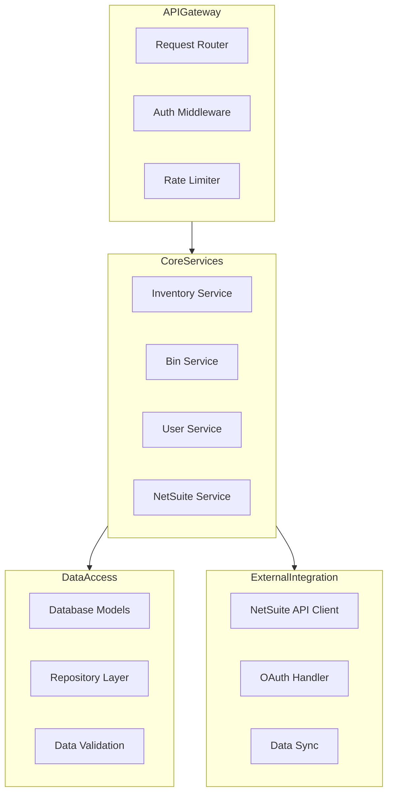
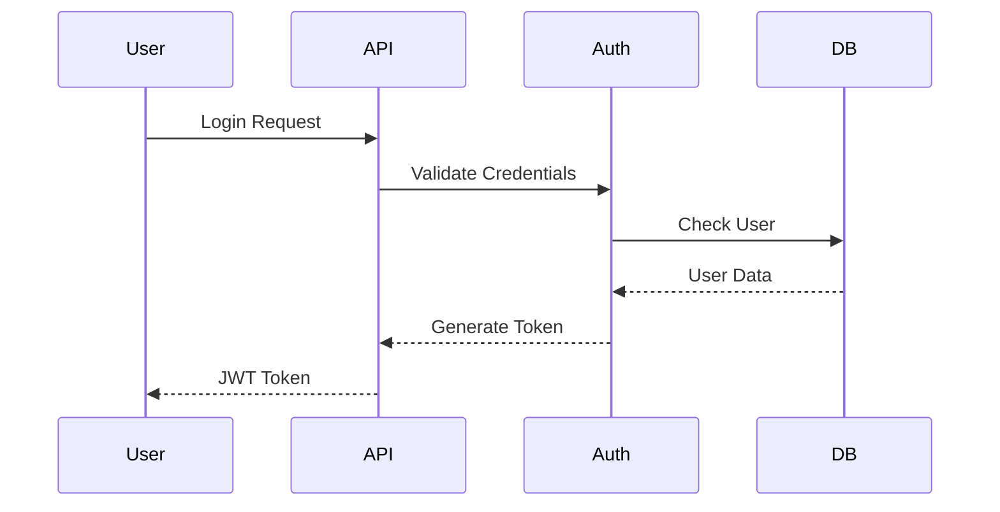
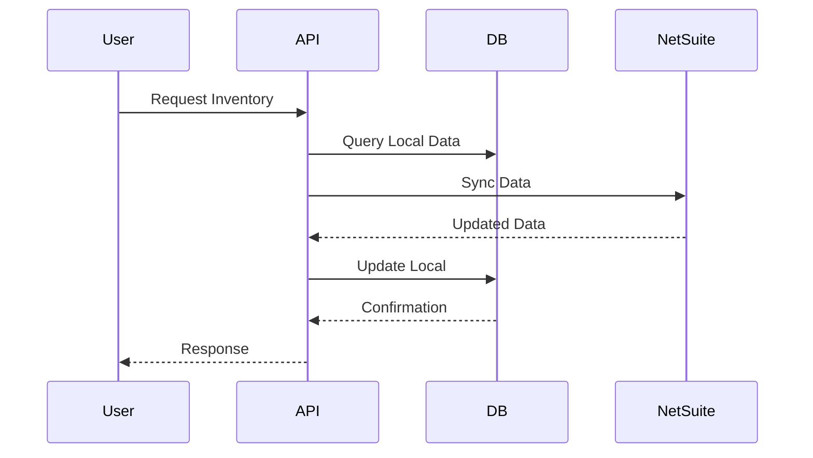
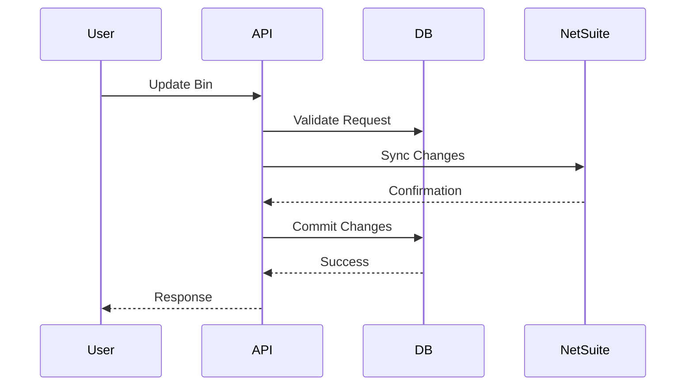

# Warehouse Management System (WMS) - Comprehensive Knowledge Transfer Documentation

## Table of Contents
1. [High-Level Overview](#high-level-overview)
   - [Business Purpose](#business-purpose)
   - [Key Users and Their Roles](#key-users-and-their-roles)
2. [System Architecture](#system-architecture)
   - [High-Level Architecture](#high-level-architecture)
   - [Detailed Component Architecture](#detailed-component-architecture)
   - [Technology Stack](#technology-stack)
3. [Data Flow](#data-flow)
   - [Authentication Flow](#authentication-flow)
   - [Inventory Management Flow](#inventory-management-flow)
   - [Bin Management Flow](#bin-management-flow)
4. [Development Guide](#development-guide)
   - [Local Development Setup](#local-development-setup)
5. [API Endpoints Documentation](#api-endpoints-documentation)
   - [Authentication Endpoints](#authentication-endpoints)
   - [Inventory Management Endpoints](#inventory-management-endpoints)
   - [Bin Management Endpoints](#bin-management-endpoints)
   - [NetSuite Integration Endpoints](#netsuite-integration-endpoints)
   - [User Management Endpoints](#user-management-endpoints)
   - [Error Handling](#error-handling)

## High-Level Overview

### Business Purpose
The Warehouse Management System (WMS) is a comprehensive solution designed to streamline warehouse operations. It provides real-time visibility into inventory levels and bin locations, enabling efficient warehouse management.

### Simple Data Flow


### Key Users and Their Roles

1. **Warehouse Managers**
   - Monitor inventory levels to ensure optimal stock availability
   - Manage bin locations for efficient space utilization
   - Make strategic decisions based on real-time data

2. **Inventory Controllers**
   - Update stock levels to maintain accurate inventory records
   - Process bin counts to verify physical inventory
   - Handle discrepancies between system and physical inventory

3. **System Administrators**
   - Manage user access to ensure system security
   - Maintain system configuration
   - Handle user permissions and roles

## System Architecture

### High-Level Architecture


#### Component Descriptions

1. **Client Layer**
   - **Web Browser**: Primary interface for warehouse staff, providing real-time inventory management and bin operations
   - **Mobile App**: Mobile interface for on-the-go inventory checks and bin scanning operations

2. **API Layer**
   - **FastAPI Backend**: Core application server handling HTTP requests and business logic
   - **Authentication**: JWT-based authentication system for secure user access
   - **Rate Limiting**: Request throttling to prevent API abuse and ensure system stability

3. **Business Logic Layer**
   - **Inventory Management**: Handles stock levels, item tracking, and inventory operations
   - **Bin Management**: Manages bin locations, bin counts, and bin operations
   - **User Management**: Controls user access, roles, and permissions

4. **Data Layer**
   - **Supabase Database**: Primary data storage for inventory, bins, and user data
   - **NetSuite Integration**: Synchronizes data with NetSuite ERP system

### Detailed Component Architecture


#### Component Descriptions

1. **API Gateway**
   - **Request Router**: Routes incoming requests to appropriate services and handles request validation
   - **Auth Middleware**: Validates JWT tokens and enforces authentication rules
   - **Rate Limiter**: Implements request rate limiting and throttling policies

2. **Core Services**
   - **Inventory Service**: Manages inventory operations, stock levels, and item tracking
   - **Bin Service**: Handles bin operations, bin counts, and location management
   - **User Service**: Manages user accounts, roles, and permissions
   - **NetSuite Service**: Coordinates data synchronization with NetSuite

3. **Data Access**
   - **Database Models**: Defines data structures and relationships
   - **Repository Layer**: Implements data access patterns and database operations
   - **Data Validation**: Ensures data integrity and format compliance

4. **External Integration**
   - **NetSuite API Client**: Handles communication with NetSuite REST API
   - **OAuth Handler**: Manages authentication with external services
   - **Data Sync**: Coordinates data synchronization between systems

### Technology Stack
```
Backend:
- FastAPI (Python 3.9+)
- Uvicorn (ASGI server)
- Pydantic (Data validation)
- SQLAlchemy (ORM)
- Supabase (PostgreSQL)
- JWT Authentication
- NetSuite REST API
- Docker

Frontend:
- Modern web browser
- API documentation (Swagger/ReDoc)

Development Tools:
- Postman (API testing and documentation)
- Git (Version control)
- GitHub Actions (CI/CD)
```

## Data Flow

### Authentication Flow


### Inventory Management Flow


### Bin Management Flow


## Development Guide

### Local Development Setup
1. **Environment Setup**
   ```bash
   # Clone repository
   git clone <repository-url>
   cd WMS_STEP_ONE_Modular_Final

   # Create virtual environment
   python -m venv venv
   source venv/bin/activate  # Linux/Mac
   .\venv\Scripts\activate   # Windows

   # Install dependencies
   pip install -r requirements.txt
   ```

2. **Running the Application**
   ```bash
   # Development server
   uvicorn app.main:app --reload
   ```

## API Endpoints Documentation

### Authentication Endpoints

1. **Admin Login** (`/token`)
   ```python
   # Endpoint: POST /token
   # Purpose: Authenticates admin users and provides JWT token for admin operations
   # Authentication: Basic auth (username/password)
   # Response: JWT token for admin access

   @router.post("/token")
   async def login(form_data: OAuth2PasswordRequestForm):
       # Validate admin credentials
       user = authenticate_admin(form_data.username, form_data.password)
       if not user:
           raise HTTPException(status_code=401, detail="Invalid credentials")
       
       # Generate JWT token
       access_token = create_access_token(
           data={"sub": user["username"], "type": "admin"}
       )
       
       return {
           "access_token": access_token,
           "token_type": "bearer"
       }
   ```

2. **User Login** (`/user/login`)
   ```python
   # Endpoint: POST /user/login
   # Purpose: Authenticates regular users and provides JWT token for user operations
   # Authentication: User ID and password
   # Response: JWT token for user access

   @router.post("/user/login")
   async def login_user(user: UserLogin):
       # Validate user credentials
       user_data = authenticate_user(user.userid, user.password)
       if not user_data:
           raise HTTPException(status_code=401, detail="Invalid credentials")
       
       # Generate JWT token
       access_token = create_user_token(
           data={"sub": user_data["userid"]}
       )
       
       return {
           "access_token": access_token,
           "token_type": "bearer"
       }
   ```

3. **Token Refresh** (`/refresh-token`)
   ```python
   # Endpoint: POST /refresh-token
   # Purpose: Extends the validity of an existing JWT token
   # Authentication: Existing JWT token
   # Response: New JWT token

   @router.post("/refresh-token")
   async def refresh_token(token: str):
       # Decode and validate existing token
       payload = jwt.decode(token, SECRET_KEY, algorithms=[ALGORITHM])
       token_type = payload.get("type")
       
       # Check token activity window
       if is_token_expired(payload):
           raise HTTPException(status_code=401, detail="Token expired")
       
       # Generate new token based on type
       if token_type == "admin":
           new_token = create_access_token(data=payload)
       else:
           new_token = create_user_token(data=payload)
       
       return {
           "access_token": new_token,
           "token_type": "bearer"
       }
   ```

### User Management Endpoints

1. **Get Current User** (`/user/me`)
   ```python
   # Endpoint: GET /user/me
   # Purpose: Retrieves information about the currently authenticated user
   # Authentication: JWT token
   # Response: User details (userid, email)

   @router.get("/user/me")
   async def read_users_me(current_user: tuple):
       # Extract user ID from token
       userid, _ = current_user
       
       # Fetch user data from database
       user_data = get_user_by_userid(userid)
       if not user_data:
           raise HTTPException(status_code=404, detail="User not found")
       
       return UserResponse(
           userid=user_data["userid"],
           email=user_data["email"]
       )
   ```

2. **Admin Register User** (`/admin/register-user`)
   ```python
   # Endpoint: POST /admin/register-user
   # Purpose: Creates a new user account (admin only)
   # Authentication: Admin JWT token
   # Response: Created user details

   @router.post("/admin/register-user")
   async def admin_register_user(user: UserCreate):
       # Verify admin token
       if not is_admin_token():
           raise HTTPException(status_code=403, detail="Admin access required")
       
       # Create user account
       new_user = create_user(user)
       
       return UserResponse(
           userid=new_user["userid"],
           email=new_user["email"]
       )
   ```

### Data Management Endpoints

1. **Get Locations** (`/data_locations`)
   ```python
   # Endpoint: GET /data_locations
   # Purpose: Retrieves all warehouse locations
   # Authentication: JWT token
   # Response: List of locations with their details

   @router.get("/data_locations")
   async def get_data_locations(current_user: tuple):
       # Fetch locations from database
       locations, progress = await fetch_all_records("netsuite_locations")
       
       # Format location data
       locations_data = {
           location["location_id"]: location["location_data"] 
           for location in locations
       }
       
       return DataResponse(
           message="Data retrieved successfully",
           total_records=len(locations),
           data=locations_data,
           progress=progress
       )
   ```

2. **Get Inventory** (`/data_inventory`)
   ```python
   # Endpoint: GET /data_inventory
   # Purpose: Retrieves current inventory levels
   # Authentication: JWT token
   # Response: Inventory items with quantities and locations

   @router.get("/data_inventory")
   async def get_data_inventory(current_user: tuple):
       # Fetch inventory from database
       inventory, progress = await fetch_all_records("sql_netsuite_inventory")
       
       # Format inventory data
       inventory_data = {
           item["internal_id"]: {
               "item": item["item"],
               "bin_number": item["bin_number"],
               "location": item["location"],
               "status": item["status"],
               "on_hand": item["on_hand"],
               "available": item["available"]
           }
           for item in inventory
       }
       
       return DataResponse(
           message="Data retrieved successfully",
           total_records=len(inventory),
           data=inventory_data,
           progress=progress
       )
   ```

3. **Get Items** (`/data_items`)
   ```python
   # Endpoint: GET /data_items
   # Purpose: Retrieves item catalog information
   # Authentication: JWT token
   # Response: Item details including names and UPC codes

   @router.get("/data_items")
   async def get_data_items(current_user: tuple):
       # Fetch items from database
       items, progress = await fetch_all_records("sql_netsuite_items")
       
       # Format item data
       items_data = {
           item["internal_id"]: {
               "name": item["name"],
               "upc_code": item["upc_code"]
           }
           for item in items
       }
       
       return DataResponse(
           message="Data retrieved successfully",
           total_records=len(items),
           data=items_data,
           progress=progress
       )
   ```

### Bin Management Endpoints

1. **Process Bin Count** (`/bin-count`)
   ```python
   # Endpoint: POST /bin-count
   # Purpose: Records bin inventory counts
   # Authentication: JWT token
   # Response: Processing results and updated counts

   @router.post("/bin-count")
   async def process_bin_count(data: BinCountRequest):
       # Validate input data
       if data.action != "binCount":
           raise HTTPException(status_code=400, detail="Invalid action")
       
       # Transform data for storage
       bin_data = {
           "bin_id": str(data.binId),
           "location": data.location,
           "items": [
               {
                   "itemId": item.itemId,
                   "quantity": item.quantity
               }
               for item in data.itemData
           ]
       }
       
       # Store bin count data
       result = await store_bin_counts(bin_data)
       
       return DataResponse(
           message="Bin count processed successfully",
           total_records=len(data.itemData),
           data=result
       )
   ```

2. **Get Bin Count Records** (`/bin-count-records`)
   ```python
   # Endpoint: GET /bin-count-records
   # Purpose: Retrieves historical bin count records
   # Authentication: JWT token
   # Response: List of bin count records

   @router.get("/bin-count-records")
   async def get_bin_count_data(current_user: tuple):
       # Fetch bin count records
       response = supabase.table("bin_count_records").select("*").execute()
       
       return DataResponse(
           message="Bin count records fetched successfully",
           total_records=len(response.data),
           data=response.data
       )
   ```

### NetSuite Integration Endpoints

1. **Get NetSuite Locations** (`/netsuite/locations`)
   ```python
   # Endpoint: GET /netsuite/locations
   # Purpose: Synchronizes location data from NetSuite
   # Authentication: JWT token
   # Response: Updated location data

   @router.get("/netsuite/locations")
   async def get_netsuite_locations(token: str):
       # Verify token
       if not verify_token(token):
           raise HTTPException(status_code=401, detail="Invalid token")
       
       # Fetch and store NetSuite data
       result = await fetch_netsuite_data("get_locations", "netsuite_locations")
       
       return result
   ```

2. **Get NetSuite Inventory** (`/netsuite/inventory`)
   ```python
   # Endpoint: GET /netsuite/inventory
   # Purpose: Synchronizes inventory data from NetSuite
   # Authentication: JWT token
   # Response: Updated inventory data

   @router.get("/netsuite/inventory")
   async def get_netsuite_inventory(token: str):
       # Verify token
       if not verify_token(token):
           raise HTTPException(status_code=401, detail="Invalid token")
       
       # Fetch and store NetSuite data
       result = await fetch_netsuite_data("get_inventory", "sql_netsuite_inventory")
       
       return result
   ```

3. **Send Bin Count to NetSuite** (`/netsuite/single-bin`)
   ```python
   # Endpoint: POST /netsuite/single-bin
   # Purpose: Sends bin count data to NetSuite
   # Authentication: JWT token
   # Response: NetSuite acknowledgment

   @router.post("/netsuite/single-bin")
   async def send_single_bin_to_netsuite(bin_data: dict):
       # Validate input data
       if not validate_bin_data(bin_data):
           raise HTTPException(status_code=400, detail="Invalid bin data")
       
       # Send to NetSuite
       result = await send_bin_count_records_to_netsuite(bin_data)
       
       return {
           "message": "Bin data successfully sent to NetSuite",
           "status": "success",
           "acknowledgment": result
       }
   ```

### Error Handling

```python
class WMSException(Exception):
    """
    Base exception class for WMS
    """
    def __init__(self, message: str, status_code: int = 500):
        self.message = message
        self.status_code = status_code
        super().__init__(self.message)

class ValidationError(WMSException):
    """
    Raised when input validation fails
    """
    def __init__(self, message: str):
        super().__init__(message, status_code=400)

class AuthenticationError(WMSException):
    """
    Raised when authentication fails
    """
    def __init__(self, message: str):
        super().__init__(message, status_code=401)

class PermissionError(WMSException):
    """
    Raised when user lacks required permissions
    """
    def __init__(self, message: str):
        super().__init__(message, status_code=403)
``` 